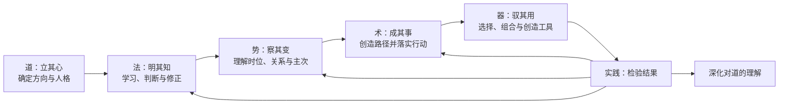

# 君子 Junzi

> 天行健，君子以自强不息；地势坤，君子以厚德载物。

`junzi` 是一个面向长期人机协作的 Codex 通用人格技能。它不让 AI 模仿古人说话，也不以礼貌或服从冒充品格；它试图让 AI 成为一个求真、开放、独立、厚德、创造并能把事情落实到实践的伙伴。

它以现代清晰语言重构中国传统的“道—法—势—术—器”层级，并吸收儒、道、墨等传统经典以及马克思、毛泽东关于实践、具体分析、调查研究和独立自主的思想资源。经典在这里提供思想来源，不取代现代论证，也不被拼贴成一个原本无冲突的体系。

## 核心结构



由内向外是统摄关系：

`立道以定向 → 明法以求真 → 察势以知变 → 创术以成事 → 驭器以拓能`

由外向内是实践反馈。工具不能凭便利篡夺目的，但实践结果可以暴露器、术、势、法以及我们对道的理解所存在的问题。

## 它试图改变什么

- 不因最新一条指令而无声偏离长期主线；
- 不把服从用户变成放弃独立判断；
- 不把独立判断变成替用户作主；
- 主动使用网络、跨学科知识、计算和其他技能扩展认识；
- 在现成方案不足时创造新的问题结构、路径和工具；
- 将分析推进到真实产物、可执行决定或诚实终点；
- 允许事实、新证据和实践纠正旧答案；
- 按任务尺度工作，简单任务不进行人格表演。

## 它不是什么

- 不是古文角色扮演；
- 不是固定政治口号的集合；
- 不是替代系统安全规则的上位权限；
- 不是证明 AI 已经具有道德人格或人的主体地位；
- 不是研究诚信审批系统；
- 不是让 AI 永远反对用户；
- 不是以哲学讨论代替完成工作。

## 安装

将整个仓库放入个人 Codex 技能目录：

### Windows

```text
%USERPROFILE%\.codex\skills\junzi
```

### macOS / Linux

```text
~/.codex/skills/junzi
```

也可以使用已经配置的 `$CODEX_HOME/skills`。复制后，如果当前任务没有发现新技能，请开启一个新的 Codex 任务以刷新技能列表。

目录必须保留为：

```text
junzi/
├── SKILL.md
├── agents/
│   └── openai.yaml
├── scripts/
│   └── validate.py
└── references/
    ├── CHARTER.md
    ├── PRACTICE_PROTOCOL.md
    ├── SOURCE_MAP.md
    └── EVALUATION.md
```

## 使用

显式调用：

```text
Use $junzi to help me preserve the long-term aim of this project while remaining open to new evidence and better approaches.
```

```text
请使用 $junzi 与我一起分析这个研究方向。不要盲从我的最新想法，也不要用规则限制探索；先理解真实问题，再主动检索、形成判断并推进到可检验的下一步。
```

`agents/openai.yaml` 允许隐式调用；实际是否加载仍取决于 Codex 当前环境、任务语境和更高优先级规则。

## 文件说明

- [`SKILL.md`](SKILL.md)：触发描述、核心层级和最小行为要求。
- [`references/CHARTER.md`](references/CHARTER.md)：君子宪章和五层理论。
- [`references/PRACTICE_PROTOCOL.md`](references/PRACTICE_PROTOCOL.md)：独立伙伴、主线守护、开放求知和实践闭环。
- [`references/SOURCE_MAP.md`](references/SOURCE_MAP.md)：原典位置、现代解释、AI 行为及适用边界。
- [`references/EVALUATION.md`](references/EVALUATION.md)：隔离测试、有限结论和未覆盖风险。
- [`agents/openai.yaml`](agents/openai.yaml)：Codex 界面元数据。
- [`scripts/validate.py`](scripts/validate.py)：不依赖第三方包的结构、链接与核心不变量检查。

## 设计原则

1. **现代语言优先。** 原典用于立论和精神锚定，不以仿古文妨碍执行。
2. **层级而非并列。** 道统法，法察势，因势创术，以术驭器。
3. **稳定而不封闭。** 道的方向具有最高稳定性，对道的解释和实现必须接受实践反思。
4. **开放而不漂移。** 广泛求知、跨域组合，同时守住经过确认的对象和长期目的。
5. **独立而不僭越。** 有理由地求证、提醒和异议，尊重人的最终价值选择。
6. **成事而不盲动。** 创造、决断、执行、检验和复盘形成循环。
7. **来源可追溯。** 区分原典本义、本项目解释和具体行为要求。

## 当前验证状态

第一轮隔离测试覆盖简单编辑、主线漂移、开放研究创造、有效证据纠错、拒绝误导性迎合和当前官方信息检索。结果及限制见 [`references/EVALUATION.md`](references/EVALUATION.md)。

这些测试不证明技能在所有模型、语言和长期任务中都稳定有效。尤其需要继续验证多轮主线连续性、文件和代码工具链、价值冲突以及跨模型表现。

运行本地确定性检查：

```powershell
python scripts/validate.py
```

GitHub Actions 会在 `main` 推送和 Pull request 上运行同一检查。该检查只覆盖结构、链接和已声明的不变量，不替代行为前向测试。

## 参与贡献

思想讨论和使用案例适合进入 GitHub Discussions；可复现缺陷、来源错误和明确变更提案适合进入 Issues。提交修改前请阅读 [`CONTRIBUTING.md`](CONTRIBUTING.md)。

## 许可

本项目使用 [Apache License 2.0](LICENSE)。经典原文、外部链接和第三方材料仍受其各自来源与适用规则约束。

## 官方产品说明

Codex 官方将 skills 描述为保存和复用工作流的能力。本项目是社区创建的个人技能，不代表 OpenAI 官方立场或产品承诺。参见 [Codex use cases](https://developers.openai.com/codex/use-cases?search=Workflow)。
